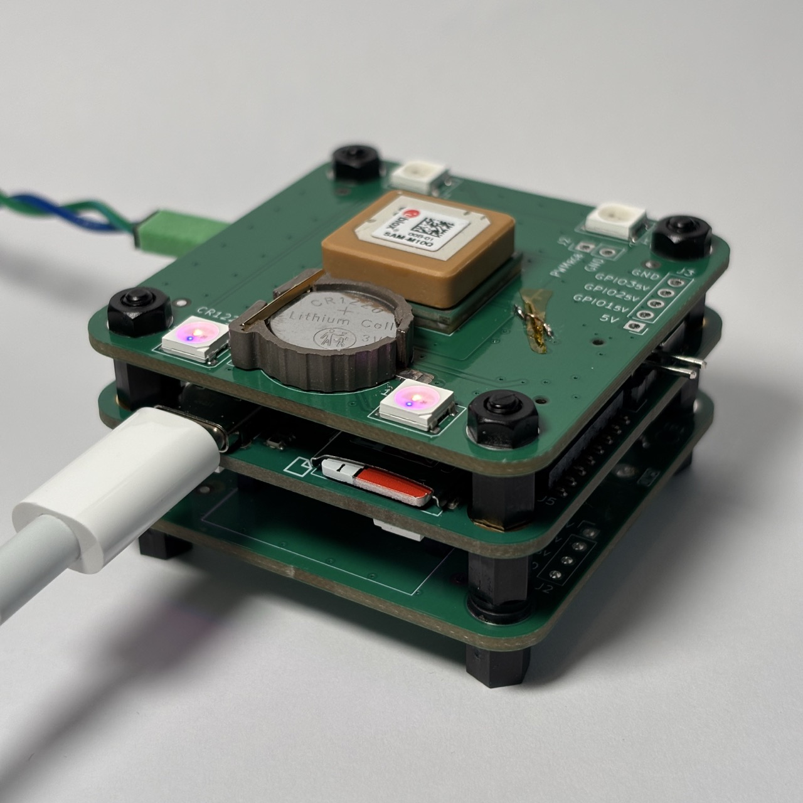
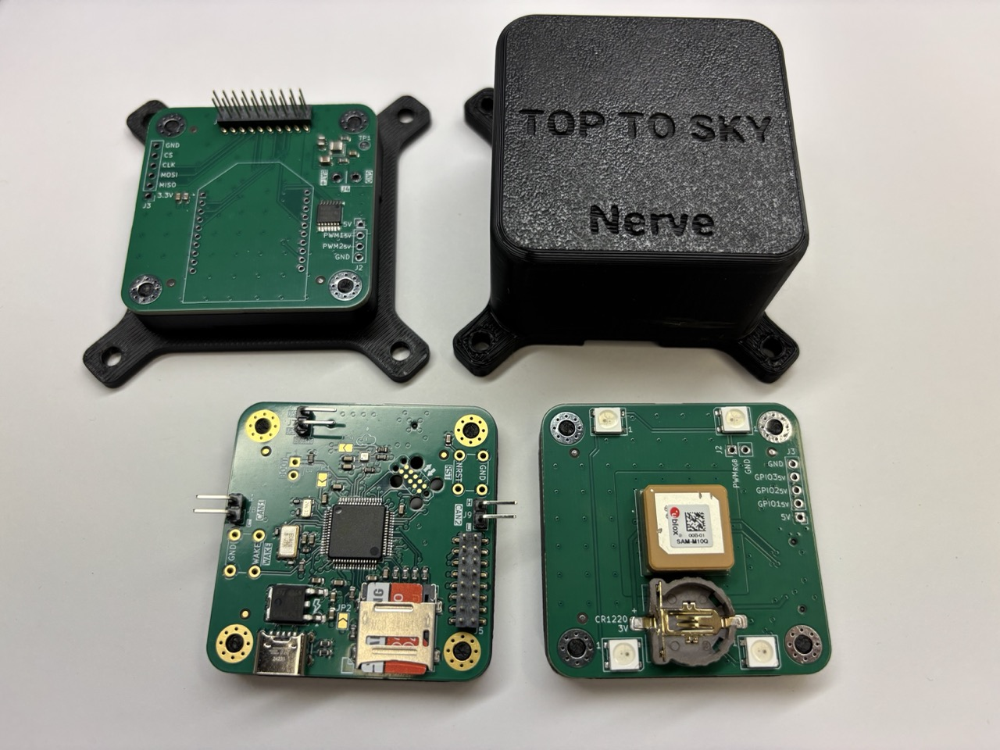

# danielljeon.github.io

---

## Info & Docs

About me: [danielljeon](danielljeon).

Personal notes: [docs](docs).

---

## Full Projects

### Nerve: 6-DOF Flight Controls

🚀 Nerve is a general-purpose controller designed for six degrees of freedom
(6-DOF) operation. Originally developed for jet vane rocket controls, it now
serves as a testbed for robotics and controls development.

> Note: This project was prematurely stopped due to shifting priorities. No full
> rocket-flight or realistic controls testing was attempted.

- Printed Circuit Board (PCB) design:
    - 4-layer, 6-layer, design for manufacturing and assembly.
- Low-level embedded firmware (STM32F446RE):
    - Timers, DMA, NVIC, SDIO, CAN (classic), I2C, SPI, UART, etc.
- Sensors and Wireless Modules:
    - Barometer, GNSS, Inertial Measurement Unit (IMU) and XBee.

|                                    Nerve Stack                                     |                                  Nerve Stack with Enclosure                                  |
|:----------------------------------------------------------------------------------:|:--------------------------------------------------------------------------------------------:|
| <div align="center"></div> | <div align="center"></div> |

Firmware:

- [nerve](https://github.com/danielljeon/nerve): Firmware for CAN-based control
  systems dev platform.

Hardware:

- [nerve_pcb](https://github.com/danielljeon/nerve_pcb): PCB for CAN-based
  control systems dev platform.
- [nerve_gps_pcb](https://github.com/danielljeon/nerve_gps_pcb): GPS module to
  `nerve_pcb`.
- [nerve_radio_pcb](https://github.com/danielljeon/nerve_radio_pcb): Radio and
  power supply module to `nerve_pcb`.


- [nerve_ada_board](https://github.com/danielljeon/nerve_ada_board): Nerve dev
  board using off-the-shelf modules.

Additional Software/Hardware:

- [gopher](https://github.com/danielljeon/gopher): Ground station for Nerve
  controller system.
    - Previously a Python desktop application for telemetry via XBee radios.

---

## Interesting Academic and Small Projects

### Soft Robotic Gripper: Software driven CAD

🎈 Pneumatic gripper project focusing on silicone mold design automated with
software for rapid design flexibility.

- Compliant manipulators.
- CAD and FEA analysis.
- Python STL file manipulation.

[soft_solution](https://github.com/danielljeon/soft_solution): software and
documentation.

### Robotic Hand: 5 DOF Humanoid Hand Prototype

🤌 Robotic hand project for actuators/power electronics and
sensors/instrumentation university courses.

- Printed Circuit Board (PCB) design.
- Low-level embedded firmware (STM32F446RE).
- PSpice (buck circuit) simulation:
    - Basic transient modeling.
    - Fast Fourier Transform (FFT).

1. [robotic_hand](https://github.com/danielljeon/robotic_hand): firmware.
2. [robotic_hand_pcb](https://github.com/danielljeon/robotic_hand_pcb): PCB
   hardware.
3. [robotic_hand_wireless](https://github.com/danielljeon/robotic_hand_wireless):
   XBee wireless telemetry display desktop application.

### Maze Bot: Terrain and Maze Solving Robot

🐁 Terrain and maze solving robot for mechatronics design university course.

- Closed cloop control systems:
    - Bilinear transform z-domain PIDs.
    - Yaw rate control, heading control and linear position control.
- Low-level embedded firmware (STM32L432KC).
- Robotic orientation frames (quaternion).

1. [maze_bot](https://github.com/danielljeon/maze_bot): firmware.
2. [maze_bot_pcb](https://github.com/danielljeon/maze_bot_pcb):
   electronic schematics (PCB not permitted by project rules).

### Drop Detect: FreeRTOS Soldering Iron Drop-Triggered Shield

🛡️ Soldering iron drop-triggered shield for real time embedded systems
university course.

- Low-level embedded firmware (STM32L432KC):
    - FreeRTOS.
- Bare metal design analysis:
    - Scheduler design, task execution timing and static code analysis.

[drop_detect](https://github.com/danielljeon/drop_detect): firmware.

### CV Relevance Learning: Online-learning CV Relevance Classifier

📷 Online-learning relevance classifier built on pre-trained computer vision for
machine learning university course.

- k-Nearest Neighbours and Incremental Gaussian Naive Bayes relevance prediction
  model for YOLOv5 detection.

[cv_relevance_learning](https://github.com/danielljeon/cv_relevance_learning):
software.

---

## Setup

This GitHub Pages repository uses submodules to pull in documentation and
references.

Quick command to pull changes from remote submodules:

```shell
git submodule update --remote --merge
```
